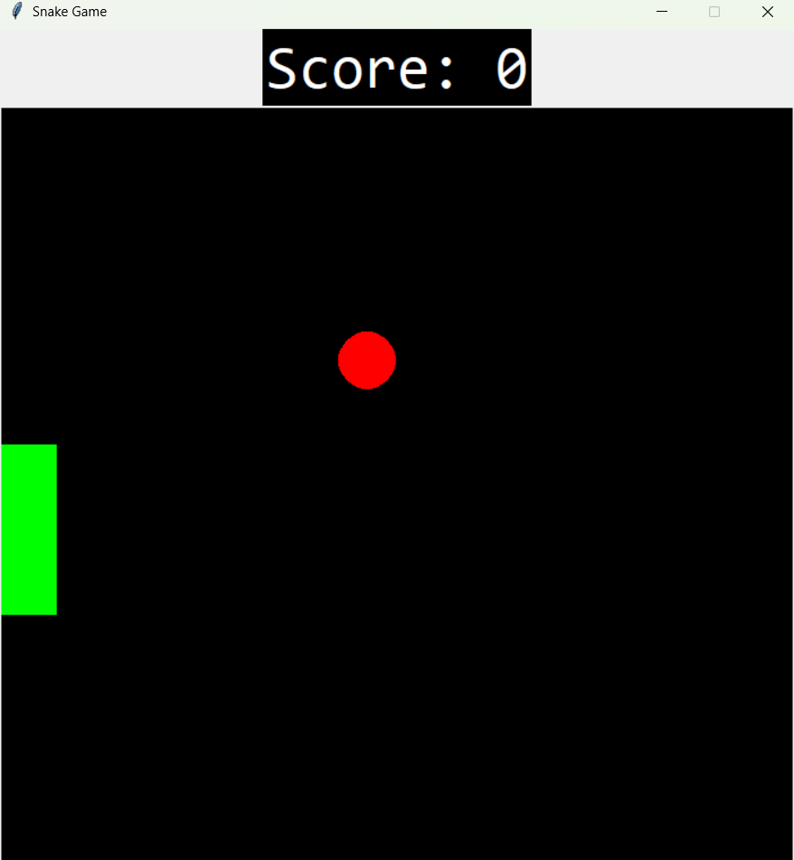

# 🐍 Python Snake Game

A classic Snake game built using Python and Tkinter GUI library.



## Features
- Classic snake gameplay mechanics
- Score tracking
- Game over detection (wall collision & self-collision)
- Restart functionality
- Clean, object-oriented code structure

## Requirements
- Python 3.x
- Tkinter (usually comes with Python)

## Installation & Running
1. Clone the repository:
   ```bash
   git clone https://github.com/your-username/python-snake-game.git
